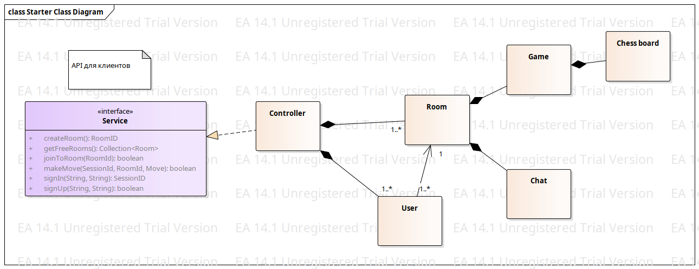

Диаграмма построена в программе Sparx. Исходник диаграммы лежит в `server.eap`

# TODO
* Надо придумать каким образом игрок будет получать информацию о ходах противника и его предложениях сдаться. Должен ли игрок сам запрашивать эту информацию или её должен отправлять сервер автоматически?
* Дописать в интерфейс возможность пригласить на игру свободных игроков
