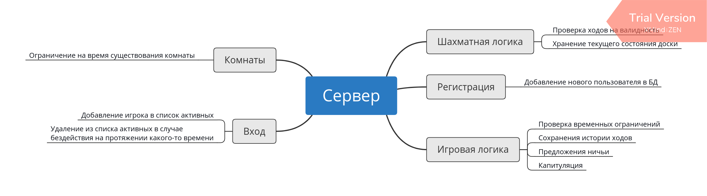

## Серверная часть
* Регистрация новых пользователей
* Обслуживание нескольких партий сразу
* Возможность сдаться/предложить ничью
* Игровой чат
* Приглашения на игру
* Поддержка ограничений по времени
* ~~Автоматический ход (если существует только один способ походить)~~
* Комнаты
* Рейтинг игрока, статистика по его партиям
* Запись всех ходов партии

Нарисовано в программе Xmind Zen. Исходник в `server.xmind`
